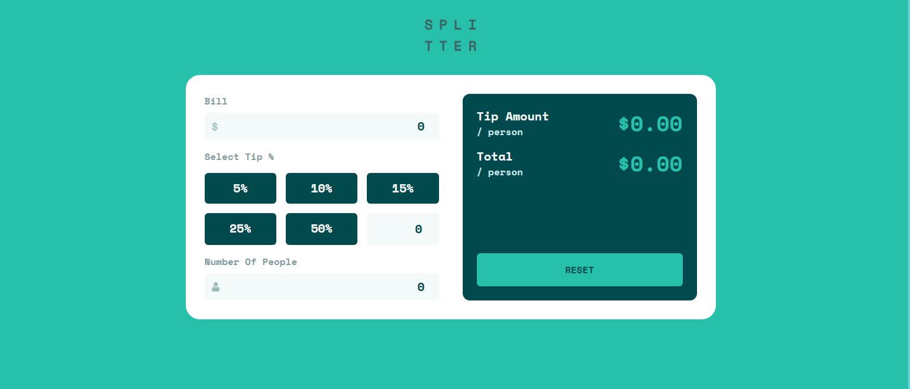
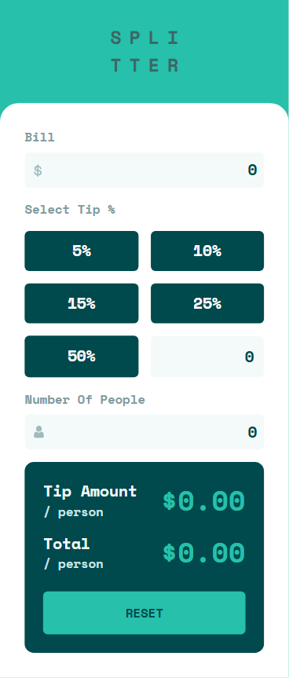

# Frontend Mentor - Tip calculator app solution

This is a solution to the [Tip calculator app challenge on Frontend Mentor](https://www.frontendmentor.io/challenges/tip-calculator-app-ugJNGbJUX). Frontend Mentor challenges help you improve your coding skills by building realistic projects.

## Table of contents

- [Overview](#overview)
  - [The challenge](#the-challenge)
  - [Screenshot](#screenshot)
  - [Links](#links)
- [My process](#my-process)
  - [Built with](#built-with)
  - [What I learned](#what-i-learned)
  - [Continued development](#continued-development)
  - [Useful resources](#useful-resources)
- [Author](#author)

## Overview

### The challenge

Users should be able to:

- View the optimal layout for the app depending on their device's screen size
- See hover states for all interactive elements on the page
- Calculate the correct tip and total cost of the bill per person

### Screenshot




### Links

- Solution URL: [https://tip-generator.vercel.app](https://your-solution-url.com)
- Live Site URL: [https://tip-generator.vercel.app](https://tip-generator.vercel.app)

## My process

### Built with

- Semantic HTML5 markup
- Flexbox
- CSS Grid
- Mobile-first workflow
- [React](https://vuejs.org/) - JS library
- [Pinia](https://pinia.vuejs.org/) - For State Management
- [TailWindCSS](https://tailwindcss.com/) - For Styling

### What I learned

I recently started to try out vue and see how it compares to React and to get more comfortable with it. I now have a better understanding of vue and the SFC for it as well. I also learnt about Pinia and how vue uses it for state management.
Also learnt how to use Template Refs in vue, which is similar to how useRef is used in React.

A little Interface I used for the state management

```typescript
export interface FormData {
  persons: number
  tipPercentage: number
  bill: number
  customPercentage: number
  useCustom: boolean
  error: {
    persons: string
    tipPercentage: string
    bill: string
  }
}
```

How I extended my tailwind theme to use custom colors.

```js
  extend: {
      colors: {
        'strong-cyan': 'hsl(172, 67%, 45%)',
        'very-dark-cyan': 'hsl(183, 100%, 15%)',
        'grayish-cyan': 'hsl(184, 14%, 56%)',
        'light-gray-cyan': 'hsl(185, 41%, 84%)',
        'very-light-cyan': 'hsl(189, 41%, 97%)',
        white: 'hsl(0, 0%, 100%)'
      },
      fontFamily: {
        'space-mono': 'Space Mono, monospace'
      }
    }
```

### Continued development

There is still alot that needs to be refactored, and there are also things that I would like to look better interms of code design. I think I could have made the tip Percentage part as its own custom component and make the form more accessible.

### Useful resources

- [Example resource 1](https://vuejs.org) - This helped me for XYZ reason. I really liked this pattern and will use it going forward.
- [Example resource 2](https://pinia.vuejs.org) - This is an amazing article which helped me finally understand XYZ. I'd recommend it to anyone still learning this concept.

## Author

- Website - [Dylan Heslop](https://www.linkedin.com/in/dylan-heslop-7223b0186)
- Frontend Mentor - [@dylan-dot-c](https://www.frontendmentor.io/profile/dylan-dot-c)
